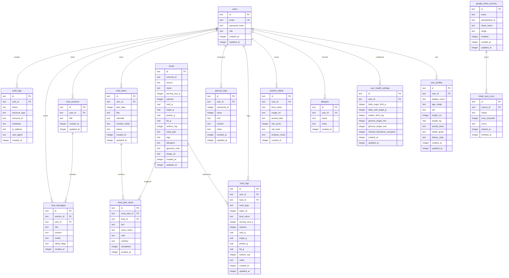

# Baojai SQLite Schema

This diagram matches the tables currently created in `db/baojai.sqlite`.

## Check Result

- `db/baojai.sqlite` has 15 tables.
- The database has 140 columns, 17 indexes, and 15 foreign keys.
- Foreign-key deletes use `CASCADE` for user-owned rows and `SET NULL` for optional references like `food_id`, `source_id`, and `audit_logs.user_id`.

## Previous Diagram Issues

- Some real columns were missing, such as `created_at`, `updated_at`, and `activity_level`.
- Some column names did not match SQLite exactly, for example `health_goals_json` should be `health_goals`.
- JSON data is stored as `text` in SQLite, so the diagram now uses the real column names instead of adding `_json`.
